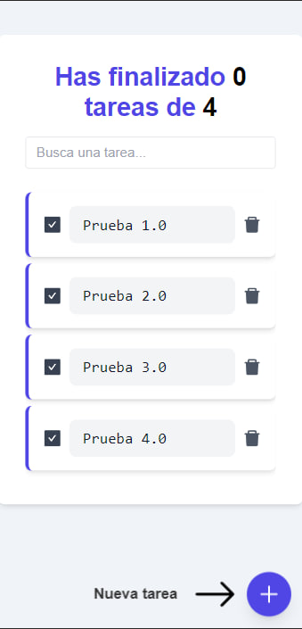
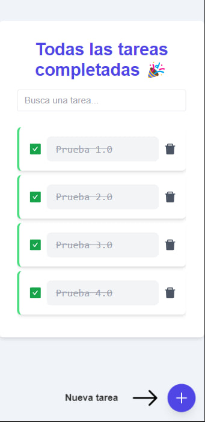
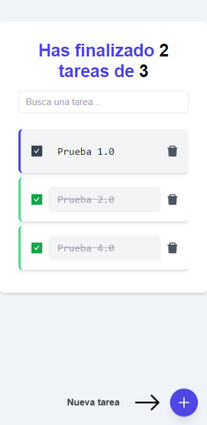
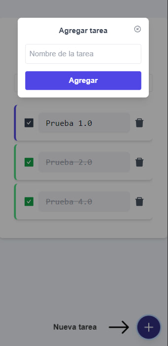

# Administrador de Tareas Web

  
_(Inserta un enlace a una imagen o GIF de tu aplicación para que los visitantes puedan tener una vista previa)_

## Descripción

El Administrador de Tareas es una aplicación web diseñada para ayudar a los usuarios a gestionar y organizar sus tareas pendientes. La plataforma es intuitiva y fácil de usar, permitiendo a los usuarios agregar, eliminar, buscar y marcar tareas como completadas con facilidad.

## Características Principales

- **Agregar Nuevas Tareas:** Los usuarios pueden añadir tareas con descripciones detalladas.
- **Marcar Tareas como Completadas:** Una vez que una tarea se ha realizado, se puede marcar como terminada para llevar un registro de los progresos.
- **Buscar Tareas:** Gracias a su buscador integrado, es posible localizar tareas específicas rápidamente.
- **Eliminar Tareas:** Permite eliminar tareas que ya no son relevantes o que se ingresaron por error.

## Uso

1. Abre la aplicación web.
2. Añade tus tareas pendientes en el campo correspondiente.
3. Una vez que completes una tarea, márcala como terminada.
4. Usa la barra de búsqueda para localizar tareas específicas.
5. Elimina tareas si lo consideras necesario.

## Tecnologías Utilizadas

- [React](https://reactjs.org/)
- [Tailwind CSS](https://tailwindcss.com/)

## Instalación y Ejecución
